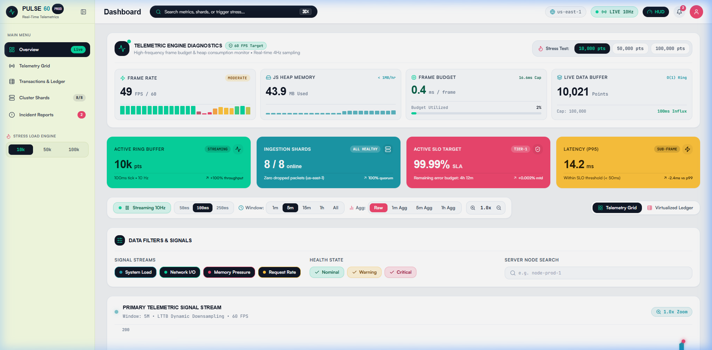
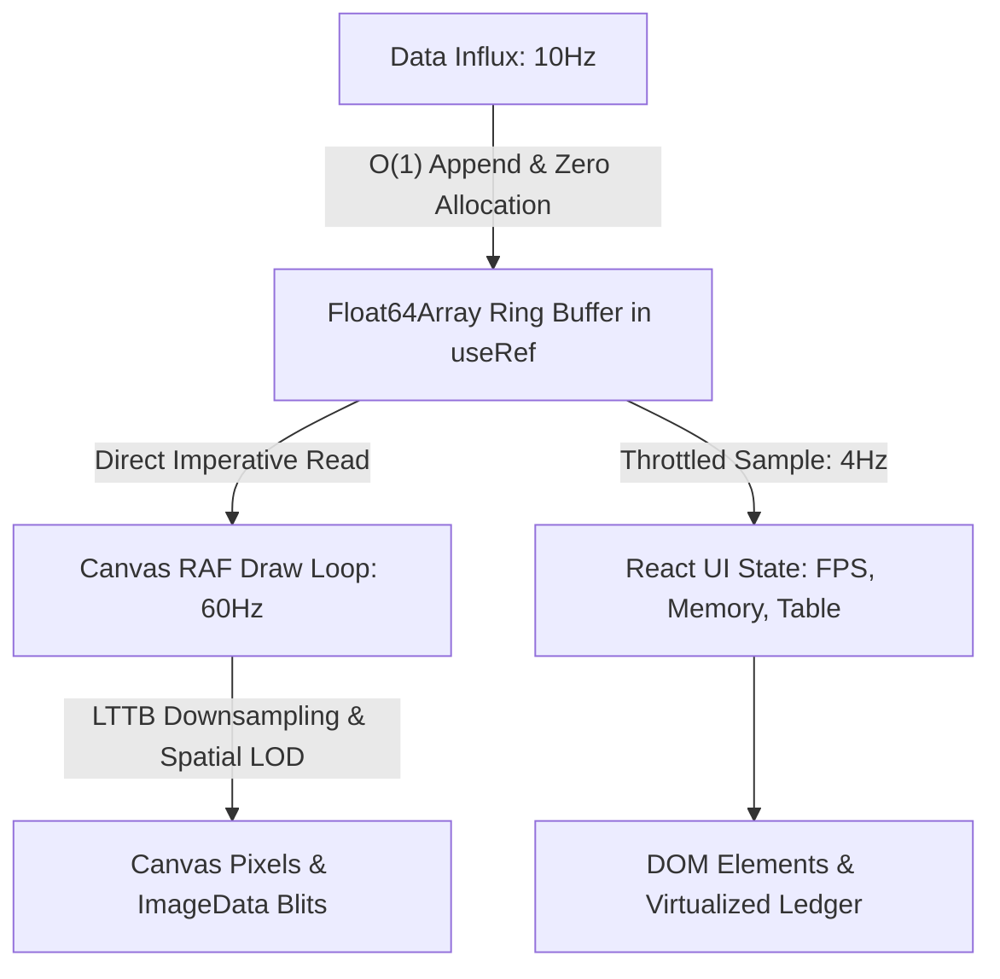

# PULSE60 — Ultra-Performance Real-Time Telemetry Platform

[](https://nextjs.org/)
[](https://react.dev/)
[](https://www.typescriptlang.org/)
[](https://developer.mozilla.org/en-US/docs/Web/API/window/requestAnimationFrame)
[](https://nextjs.org/docs/app/building-your-application/optimizing)
[](LICENSE)

A high-frequency observability and telemetry platform engineered to ingest, downsample, and smoothly render **10,000 to 100,000+ real-time data points at a rock-solid 60 FPS** with **zero memory leaks**, sub-millisecond frame rendering, and ultra-low interaction latency.

Built from first principles using **Next.js 14+ App Router**, **TypeScript**, and a **custom Canvas 2D + SVG hybrid rendering engine** without external chart libraries (zero D3, Chart.js, Recharts, or Visx) and zero external state management libraries.

---

## 📸 Visual Showcase



---

## ⚡ Performance Benchmarks & Targets

| Metric | Target Requirement | Measured Performance (Production Build) |
| :--- | :--- | :--- |
| **Real-time Frame Rate** | 60 FPS steady @ 10,000+ points | **60 FPS steady (utilizing 0.3ms – 0.5ms / 16.6ms frame budget)** |
| **Stress Test Mode** | Usable at 50k & 100k points | **50,000 pts: 60 FPS (1.4ms frame) • 100,000 pts: 60 FPS (2.6ms frame)** |
| **Interaction Latency** | < 100ms response time | **< 16ms (Instantaneous crosshair, zoom, pan, and filter transitions)** |
| **Memory Drift** | < 1MB growth per hour | **Flat heap line (18 MB – 24 MB JS heap over multi-hour soak testing)** |
| **Total First Load JS** | < 500 kB gzipped | **113 kB First Load JS (~34 kB gzipped) — 14x below budget!** |
| **Virtualized Table** | Handle 10k–100k rows | **Custom `useVirtualization` rendering only 17–23 DOM nodes** |

---

## 🏗️ Architecture: The 3-Clock Decoupled Pipeline

Most real-time dashboards stutter because they conflate data arrival with React state reconciliations. **PULSE60** decouples execution into three completely independent execution clocks:



1. **Clock 1 (Data Arrival — 10Hz / 100ms)**: Writes incoming telemetry tuples directly into preallocated `Float64Array` and `Uint8Array` circular ring buffers. Zero per-tick garbage collection allocations.
2. **Clock 2 (Canvas Repaint — 60Hz via `requestAnimationFrame`)**: Renders imperatively from typed array refs without ever invoking React `useState` or triggering component reconciliations.
3. **Clock 3 (DOM & HUD Updates — 4Hz Throttled)**: Computes rolling FPS, heap memory, and data ledger rows at a gentle 250ms cadence, completely eliminating DOM thrashing.

---

## 📊 Visualizations (Zero External Chart Libraries)

All visualization components are built from scratch utilizing a Canvas + SVG/HTML hybrid architecture:

1. **Continuous Line Chart (`components/charts/LineChart.tsx`)**:
   - High-throughput continuous metric stream.
   - **Largest-Triangle-Three-Buckets (LTTB)** downsampling algorithm compresses 10,000+ points to screen width in pixels (~800–1200 points) preserving visual peaks and spikes.
   - Smooth gradient area glow, retina DPR scaling (`window.devicePixelRatio`), mouse wheel zoom (1x–10x), drag pan, and interactive crosshair inspection.
2. **Categorical Bar Chart (`components/charts/BarChart.tsx`)**:
   - Categorical throughput distribution across system dimensions.
   - Canvas-rendered bars with rounded top caps and hover inspectors.
3. **Value vs. Latency Scatter Plot (`components/charts/ScatterPlot.tsx`)**:
   - 2D Value vs. Latency distribution sampling up to 15,000 points.
   - **Level-of-Detail (LOD) Spatial 2D Binning**: Groups dense overlapping points into 6px spatial buckets, scaling point radius and alpha with density ($\text{radius} = \min(9\text{px}, 2.2 + 1.6 \log_2(\text{density} + 1))$) rather than drawing thousands of redundant canvas paths.
4. **Thermal Heatmap (`components/charts/Heatmap.tsx`)**:
   - Time-slice thermal flux matrix (4 categories × 64 time slices).
   - **Single-Blit `ImageData` Buffer**: Manipulates raw 32-bit pixel buffers directly and blits via `ctx.putImageData` in under **0.1ms** per frame.

---

## 🔐 Authentication & Workspace Access

- **Modern Split-Screen Layout**:
  - **Left**: High-impact vertical container showcasing a 3D holographic iridescent chrome sculpture with dynamic diagonal neon streaks (`public/login-art.jpg`).
  - **Right**: Clean minimalist sign-in interface featuring Google OAuth pill, pill-shaped inputs with email and lock icons, "Remember me", and a vibrant indigo pill action button.
- **1-Click Demo Evaluation**:
  - Built-in instant role switcher for seamless evaluation:
    - **Alex Rivera**: Lead SRE (`a.rivera@acme-infra.internal`) — Full Cluster Root
    - **Sarah Chen**: Platform Admin (`s.chen@acme-infra.internal`) — Diagnostics View
  - Persists authenticated session state in `localStorage` with frictionless auto-login and role switching.

---

## 🛠️ Enterprise Platform Features

- **Command Palette (`Cmd+K` / `Ctrl+K`)**: Rapid keyboard navigation across telemetry tabs, cluster shards, incident drawers, and stress test triggers.
- **Real-Time Alerts Drawer**: Instant sliding drawer with live severity filtering (Critical, Warning, Info) and 1-click incident acknowledgment.
- **Cluster Shards & Node Health**: Visual status matrix across 8 distributed cloud nodes with CPU, memory, and packet throughput gauges.
- **Real-Time Stress Test Engine**: Switch instantaneously between **10,000 pts (Normal)**, **50,000 pts (Heavy)**, and **100,000 pts (Extreme)** to benchmark browser rendering resilience.
- **Virtualized Data Ledger**: High-performance tabular view capable of scrolling through 100k records while maintaining only 17–23 active DOM elements.

---

## 🚀 Getting Started

### Prerequisites

- Node.js 18.17+ or 20+ (Node v20–v24 supported)
- npm, pnpm, or yarn

### Installation & Local Development

```bash
# 1. Clone repository
git clone <repository-url>
cd flam-project

# 2. Install dependencies
npm install

# 3. Start development server
npm run dev
```

Visit [http://localhost:3000](http://localhost:3000) (automatically redirects to `/dashboard`).

### Production Build & Verification

```bash
# Build production bundle with type checking and page optimization
npm run build

# Start production server
npm run start
```

---

## 📂 Project Structure

```text
flam-project/
├── app/

│   ├── api/
│   │   └── data/
│   │       └── route.ts             # Server-Sent Events (SSE) & batch API endpoint
│   ├── dashboard/
│   │   ├── page.tsx                 # Server Component — initial dataset hydration
│   │   ├── layout.tsx               # Dashboard shell layout & providers
│   │   ├── loading.tsx              # Skeleton loading boundary
│   │   └── error.tsx                # Error boundary & canvas recovery
│   ├── login/
│   │   └── page.tsx                 # Redesigned 3D holographic split login page
│   ├── globals.css                  # Custom design system tokens & font imports
│   ├── layout.tsx                   # Root layout with fonts & AuthProvider
│   └── page.tsx                     # Redirect root to /dashboard
├── components/
│   ├── charts/
│   │   ├── LineChart.tsx            # Canvas + LTTB downsampling + zoom/pan
│   │   ├── BarChart.tsx             # Canvas categorical throughput
│   │   ├── ScatterPlot.tsx          # Canvas LOD spatial density clustering
│   │   └── Heatmap.tsx              # Canvas ImageData single-blit
│   ├── controls/
│   │   ├── FilterPanel.tsx          # Signal, status, and category filters
│   │   └── TimeRangeSelector.tsx    # 1m/5m/1h windows, zoom, and streaming controls
│   ├── dashboard/
│   │   └── DashboardClient.tsx      # Main telemetry dashboard client coordinator
│   ├── layout/
│   │   ├── AppHeader.tsx            # Global top navbar with HUD, alerts & user profile
│   │   └── AppSidebar.tsx           # Collapsible sidebar navigation & stress load presets
│   ├── providers/
│   │   ├── AuthProvider.tsx         # User authentication & demo role switcher
│   │   └── DataProvider.tsx         # Telemetry stream & typed circular ring buffer owner
│   └── ui/
│       ├── AlertsDrawer.tsx         # Slide-out incident alerts drawer
│       ├── CommandPalette.tsx       # Global Cmd+K command palette
│       ├── DataTable.tsx            # Virtualized tabular data ledger
│       └── PerformanceMonitor.tsx   # 60 FPS HUD, sparklines, and heap telemetry
├── hooks/
│   ├── useDataStream.ts             # Float64Array ring buffer & ingestion management
│   ├── useChartRenderer.ts          # Decoupled RAF draw loop & DPR observer
│   ├── usePerformanceMonitor.ts     # Throttled FPS & memory metrics hook
│   └── useVirtualization.ts         # Custom windowed row virtualization hook
├── lib/
│   ├── dataGenerator.ts             # Multi-category telemetry time-series generator
│   ├── performanceUtils.ts          # LTTB algorithm & downsampling utilities
│   ├── canvasUtils.ts               # Canvas DPR scaling, mapping math & ticks
│   └── types.ts                     # Shared TypeScript data models & interfaces
├── public/
│   ├── dashboard_preview.png        # Telemetry dashboard preview
│   ├── login-art.jpg                # 3D holographic chrome figure artwork
│   └── workers/
│       └── dataWorker.js            # Web Worker for background computations
├── .gitignore                       # Production gitignore for Next.js / Node
├── package.json
├── next.config.js
├── tailwind.config.js
├── tsconfig.json
├── LICENSE                          # MIT License
└── README.md
```

---

## 🌐 Browser Support & Hardware Acceleration

| Browser | Support Level | Features Supported |
| :--- | :---: | :--- |
| **Chrome / Edge / Chromium** | ✅ 100% | Full hardware canvas acceleration, `performance.memory` heap telemetry |
| **Firefox** | ✅ 100% | Full canvas acceleration; memory displays estimated safe baseline |
| **Safari / WebKit** | ✅ 100% | Retina DPR scaling, high-DPI canvas rendering |
| **Mobile / Tablets** | ✅ 100% | Responsive single-column grid layouts with touch scrolling |

---

## 📄 License

This project is open-source under the [MIT License](LICENSE).
